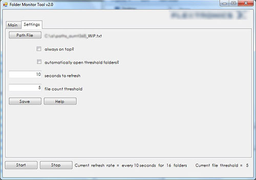

# Two stand-alone utility applications...

**"All this aggravation ain't satisfactioning me"** 
&nbsp;&nbsp;&nbsp;&nbsp;&nbsp;&nbsp;-Elvis Presley

### Disclaimer
In early 2014 I decided to learn a little vb.net to make my life as a sys admin a little easier. As of 2017, both of the resulting programs are still being used to assist in the manufacturing of **Apple's** flagship desktop computer, **[The Mac Pro](https://www.apple.com/mac-pro/)**. The code you see is the gist of both programs (without all the scaffolded stuff). Also, rest assured that no NDAs were harmed in the making of this repository.

### Behold! The FolderMonitoringTool...

It is state-of-the-art manufacturing facility, and their SMT (surface mount technology) database generates .xml files to pass information from one machine / process to the next.  At the end of each procedure, if all is well, those .xml files are then parsed back into the database. If all did not go well, those files either bottleneck at the process where the error occurs or, even worse, populates the database with incorrect data.

After spending a few days manually opening 30 different remote directories and keeping a constant eye on them, I decided to automate that process. The result is this application, which monitors any directory specified by the user, throwing visual alerts should any specified thresholds occur.

---

### Behold! The RemoteServicesManager

Several times a day, certain server-based processes would get hung and need to be remotely restarted.  The process was easy enough, but it took longer than I thought it should (firing up the virtual machine, network latency, etc.).  Plus, if there were too many people logged into said server you had to find out who was logged in and then ask them to log out (if they were done doing whatever it was that they were doing).  So, to alleviate my frustrations, and also for kicks, I decided to see what I could do.

This application allows the user to start and stop services from a list of user-specifed remote servers, as well as view the last 100 errors related to each service.  So, instead of taking 5 minutes to restart a service, it now takes 20 seconds.  And, as an added bonus, it also bypasses the user limit, allowing access as long as the user had access right via Active Directory.
